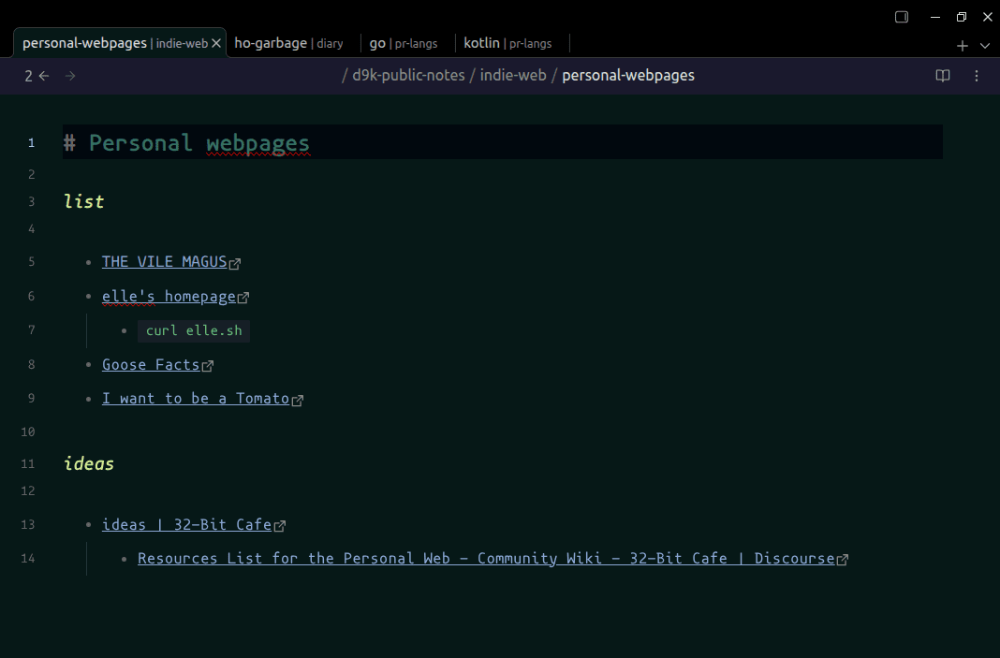

# Obsidian path in tab title plugin



## Installation

Copy over `main.js`, `manifest.json` to your vault into subfolder `.obsidian/plugins/path-in-tab-title/`. Restart Obsidian, enable plugin in settings (`[Cogwheel button] -> Community plugins -> Installed Plugins`)

## Styling

Recommended styles:

```css
.workspace-tab-header-inner-title small {
  opacity: 70%;
}
```

## Build with

- [obsidian-sample-plugin](https://github.com/obsidianmd/obsidian-sample-plugin) by [obsidianmd](https://github.com/obsidianmd)
	- _Template for Obsidian community plugins with build configuration and development best practices._

## See also

- [d9k-obsidian-style-guide](https://github.com/d9k/d9k-obsidian-style-guide) 
